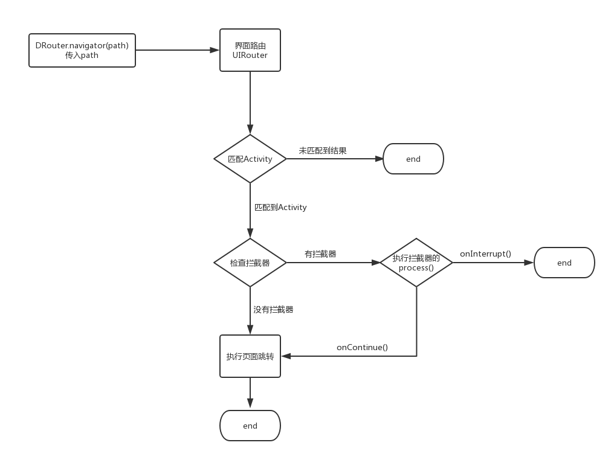
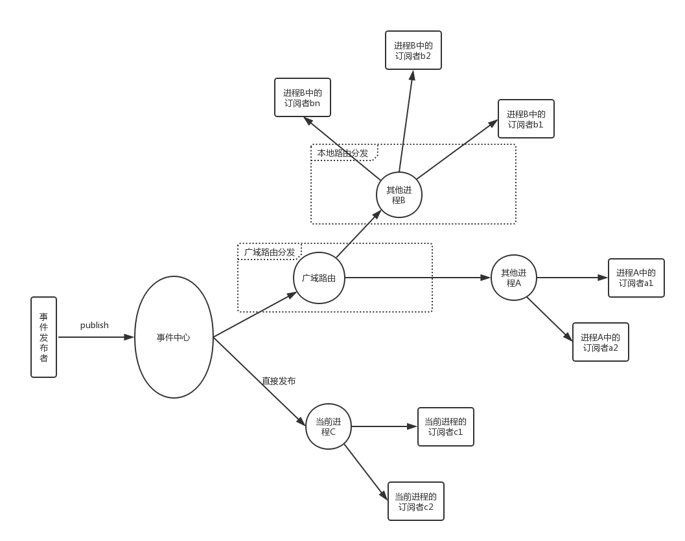
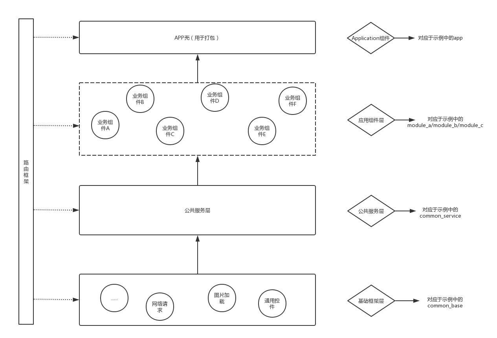
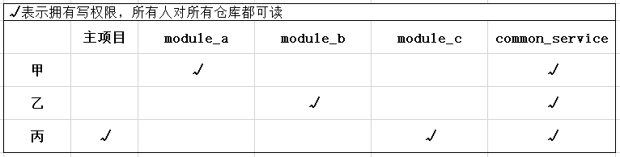

## 写在开头

组件化技术适用于需要多人协作的中大型项目，如果是一个人的项目且开发人员未实践过组件化方案则不建议采用。

## 组件化的优点

1. 业务隔离，使得各业务模块专注于自己的业务实现，而不必关心其他业务模块.
2. 单独调试，每个模块可以独立运行，方便开发调试.
3. 组件可复用性，针对有重叠业务的不同APP，可直接使用组件来组装.
4. 适合AOP.
5. 可以更细粒度的设置组员的代码修改权限.

## DRouter：简单易用的支持多进程架构的组件化方案

[demo下载](https://github.com/Dovar66/DRouter/blob/master/assets/app-debug.apk)

[DRouter目前已应用于触电新闻](https://sj.qq.com/myapp/detail.htm?apkName=com.touchtv.touchtv)

	DRouter主要提供三大功能：界面路由、动作路由和事件总线，帮助Android开发者更容易地完成项目的组件化改造。
	特别是对于多进程应用，引入DRouter能够让开发者在不用了解AIDL的情况下就可以进行跨进程通信.

### 框架特点

    * 完美支持多进程，且不需要使用者去bindService或自定义AIDL.
    * 页面路由：支持给Activity定义url，然后通过url跳转到Activity,支持添加拦截器.
    * 支持跨进程的API调用(动作路由).
    * 支持跨进程的事件总线.
    * 基于AOP引导Module的初始化以及页面、拦截器、Provider的自动注册.

### 如何配置

1.在项目根目录的 build.gradle 中添加 JitPack 仓库:

	allprojects {
		repositories {
			...
			maven { url 'https://jitpack.io' }
		}
	}

2.在BaseModule中添加依赖：

    api 'com.github.Dovar66.DRouter:router-api:1.0.5'

3.在其他需要用到DRouter的组件中添加注解处理器的依赖：

    annotationProcessor 'com.github.Dovar66.DRouter:router-compiler:1.0.5'

    同时在这些组件的defaultConfig中配置注解参数，指定唯一的组件名：

     defaultConfig {
            javaCompileOptions {
                annotationProcessorOptions {
                    arguments = [moduleName: project.getName()]
                }
            }
        }

4.多进程配置：

    * 如果你的项目需要使用多进程广域路由，那么请让你的Application实现 IMultiProcess 接口，广域路由默认是关闭状态，只有实现了该接口才会启用。

    * 在App module的build.gradle文件中，且必须在apply plugin: 'com.android.application'之后引用编译插件RouterPlugin，具体如下：

        apply plugin: 'com.android.application'

        apply plugin: "com.dovar.router.plugin" //必须在apply plugin: 'com.android.application'之后，否则找不到AppExtension

        buildscript {
            repositories {
                google()
                maven {
                    url "https://plugins.gradle.org/m2/"
                }
            }
            dependencies {
                classpath "gradle.plugin.RouterPlugin:plugin:2.0.0"
            }
        }

### 如何使用

#### 在Application.onCreate()中完成初始化

    DRouter.init(app);

#### 创建组件初始化入口(非必须)

    在组件中创建BaseAppInit的子类，并添加Module注解:

        @Module
        public class AInit extends BaseAppInit {

            @Override
            public void onCreate() {
                super.onCreate();
                //与Application.onCreate()的执行时机相同
                //建议在这里完成组件内的初始化工作
            }
        }
        
    注解处理器会将AInit注册到DRouter，当DRouter初始化时，会调用被注册的BaseAppInit子类的onCreate().
    BaseAppInit中提供了Application实例，用于组件工程中获取全局的应用上下文.

#### 页面路由

     添加Route注解,可通过interceptor设置拦截器:

     @Route(path = "/b/main", interceptor = BInterceptor.class)
     public class MainActivity extends AppCompatActivity {

         @Override
         protected void onCreate(Bundle savedInstanceState) {
             super.onCreate(savedInstanceState);
             setContentView(R.layout.module_b_activity_main);
         }
     }

     然后在项目中使用DRouter进行页面跳转:

     DRouter.navigator("/b/main").navigateTo(mContext);

#### 动作路由(API调用)

    创建相应的AbsProvider子类并添加Provider注解，然后在类中注册Action:

    @Provider(key = "a")
    public class AProvider extends AbsProvider {
        @Override
        protected void registerActions() {

            registerAction("test1", new Action() {
                @Override
                public RouterResponse invoke(@NonNull Bundle params, Object extra) {
                    Toast.makeText(appContext, "弹个窗", Toast.LENGTH_SHORT).show();
                    return null;
                }
            });

            registerAction("test2", new Action() {
                 @Override
                 public RouterResponse invoke(@NonNull Bundle params, Object extra) {
                    if (extra instanceof Context) {
                       Toast.makeText((Context) extra, params.getString("content"), Toast.LENGTH_SHORT).show();
                    }
                    return null;
                 }
            });
        }
    }

    接下来就可以在项目中使用:

           DRouter.router("a","test1").route();

           DRouter.router("a","test2")
                           .withString("content","也弹个窗")
                           .extra(context)
                           .route();
           //跨进程调用            
           DRouter.multiRouter("a","test1").route(process);
           
    需要注意的是，跨进程调用时，目标Action将会在Binder线程中执行，可以通过设置runOnUiThread指定Action在ui线程执行.
    
           DRouter.multiRouter("a","test1").runOnUiThread().route(process);
           
#### 事件总线

##### 订阅事件

	有两种订阅方式：
	
    1.生命周期感知，不需要手动取消订阅：
    
        DRouter.subscribe(this, ServiceKey.EVENT_A, new EventCallback() {
            @Override
            public void onEvent(Bundle e) {
                Toast.makeText(MainActivity.this, "/b/main/收到事件A", Toast.LENGTH_SHORT).show();
            }
        });
    
    2.需要手动取消订阅：
    
        Observer<Bundle> mObserver = DRouter.subscribeForever("event_a", new EventCallback() {
            @Override
            public void onEvent(Bundle e) {
                Toast.makeText(MainActivity.this, "/b/main/收到事件A", Toast.LENGTH_SHORT).show();
            }
        });

##### 发布事件(在任意线程)(开启多进程配置后，事件会分发到所有进程)

     Bundle bundle = new Bundle();
     bundle.putString("content", "事件A");
     DRouter.publish(ServiceKey.EVENT_A, bundle);

##### 退订事件(通过subscribeForever()订阅时,需要及时取消订阅)

     DRouter.unsubscribe("event_a", mObserver);
        
### 混淆配置

    -keep class com.dovar.router.generate.** { *; }
      
### DRouter的组件化实现原理

#### 界面路由
	
	支持给Activity定义path，然后通过path跳转到Activity,可设置跳转拦截器.

#### 动作路由

	服务提供者向DRouter注册Action实现对其他组件和进程暴露服务。注意：跨进程调用时传递的参数需要实现序列化，否则会被DRouter过滤掉.

#### 事件总线

#### 组件化项目架构图

关于APP壳工程

    管理打包配置.
    设置组件引用.
    集中管理混淆规则，各个组件中不再配置混淆文件.
    
关于应用组件层

    业务中心，包含所有业务组件.
    
关于公共服务层
    
    管理跨组件调用和公共资源，详细可参考项目中的common_service.
    
    为什么要在基础框架层和应用组件层中间多架设一个公共服务层？
    
    * 封装对基础框架层功能API的调用，方便应对日后更换第三方库的需求，相信很多程序员都经历过更换第三方库(特别是基础库)的痛苦啦，
      如果项目中没有自己封装而是直接引用第三方API的话，等到要换的时候就会发现需要修改的代码实在太多了。
    * 储存公用资源和代码，暴露给上层业务使用，同时避免这些资源被下沉到基础框架层,从而减少对基础框架层的非必要更新。
      在多人协作项目中，基础框架必须是稳定的，所以我们希望有尽可能少的commit指向基础框架层。

关于基础框架层

    与业务无关的通用功能模块，如网络请求、图片加载、通用的自定义控件等.

### 组件化后如何配置Module单独调试？

    设置一个可运行的壳工程，如示例中的app.然后在壳工程中配置组件依赖，要单独调试某个组件的时候将其他组件依赖注释掉即可.
	 
### 组件化后的资源文件处理

#### 1. AndroidManifest.xml合并：

  每个module都有一份自己的AndroidManifest清单文件，在APP的编译过程中最终会将所有module的清单文件合并成一份。

  我们可以在配置为Application的module下的build/intermediates/manifests路径下找到合成后的AndroidManifest文件,对比编译前后的差异就能大致分析出合并规则和冲突处理规则。

  需要注意的是如果在多个module中出现同名资源(如 android:label="@string/app_name")，且同名资源被合成后的AndroidManifest.xml引用，则会优先取用当前ApplicationModule的资源。

#### 2. R文件：

    libModule中R文件里的id不再是静态常量，而是静态变量，所以不能再使用switch..case..语法操作资源id

#### 3. 其他resource：

    1. 防止出现同名资源，建议每个module下的资源命名都增加唯一识别字符，如module-live中的都带前缀"mlive_"，mlive_icon_close.png

        apply plugin: 'com.android.library'
        
        android {
            compileSdkVersion 27
        
            defaultConfig {
                minSdkVersion 15
                targetSdkVersion 27
                ...
            }
        
            resourcePrefix "module_a_" //可以利用 resourcePrefix 限定资源命名前缀
        }
    
    2. 关于资源的拆分，一些style、常见的string、共用的图片、drawable等资源，建议存放在common_service当中。对于属于不同模块的资源则应该存放在各自的module中。

### 组件化后的Git部署

    Note:你依然可以沿用现有项目的版本管理方案，可跳过此部分内容.
    
一般我们项目只会对应于一个Git仓库，于是所有开发成员都可以对项目中所有代码进行编辑并提交修改，但作为项目管理者，我们想让成员只能提交自己负责的业务代码，避免成员在开发过程中不小心修改了其他成员的代码导致出现bug。而通过组件化后，我们就可以根据成员开发职责重新设置代码修改权限啦。
     
假设：在开发过程中基础框架层不变，甲负责module_a，乙负责module_b，丙负责module_c和打包，甲乙丙都可以修改common_service。于是我们将module_a/module_b/module_c/common_service全都独立成子仓库，module_a仓库只对甲开放修改权限，module_b仓库只对乙开放修改权限，module_c仓库只对丙开放修改权限，于是就有下图所示的权限分布：

有以下三种Git部署方式可供选择：

    * 主项目下直接部署多个子仓库
        直接在主项目下引入所有子仓库.
        优点：不用学习新的Git命令.
        缺点：下载主项目时操作较复杂，需要先clone主项目然后再在主项目下clone所有子项目.(可以通过配置脚本完成一键clone).
        
    * git submodule
        关于submodule如何使用请自行百度.
        优点：使用比subtree简单，也没有第一种方式的Git clone问题.
        缺点：submodule的方式不能将在主项目中对子项目的修改推送到子项目仓库.
        
    * git subtree
        [如何使用](https://blog.csdn.net/Dovar_66/article/details/83185288)
        优点：可以将在主项目中对子项目的修改推送到子项目仓库.
        缺点：Git命令使用较复杂，组员学习成本高.
    
我目前用的第一种方式。附一个AS插件，可能用得上：[一键Git Pull项目下所有仓库的当前分支](https://github.com/Dovar66/gitpullextender)

### 如何逐步的进行组件化改造？

    完全的组件化拆分并非一两日就能完成，而我们的项目却总会不断有新的需求等待开发，版本迭代工作几乎注定了我们不可能将项目需求暂停来做组件化。
    那么，版本迭代与组件化拆分就需要同步进行，下面是我的建议：
    
    1.开始准备：
    * 新增APP壳工程，建议参考本项目中的app工程.
    * 将你项目当前的application工程作为公共服务层(后面直接用common_service表示)，当然，由于还未开始拆分组件，所以此时它也是最大的业务组件.
    * 新增一个组件(后面用module_search表示)，建议优先选择一个自己最熟悉或相对简单的业务模块着手，比如我自己公司项目的搜索模块，它只有搜索功能且与其他模块交互很少，所以我选择由它开始。
    
    2.建立依赖链：
    壳工程依赖common_service.
    壳工程依赖module_search.
    module_search依赖common_service.(implementation依赖)
    
    3.引入DRouter:
    参考上面的DRouter使用说明.
    
    4.分离公共服务层与基础架构层(非必须)：
    如果之前你的项目没有分离业务层和基础架构层，那么建议你现在将基础架构从common_service中抽离出来.
    
    5.逐步拆分组件：(这个过程短则几天，长则数月，项目越大耦合越重则耗时越长，建议徐徐推进)
        拆分第一个组件：
            * 前面我们已经新增了module_search，所以现在要将搜索模块的代码从common_service中抽离并放入搜索组件，此时搜索组件依然可以直接引用公共服务层的代码，但公共服务层则只能通过路由使用搜索功能.
            * 在开发主线做新需求时，新增的资源文件建议最好放到对应的组件工程中，之前的资源文件可以暂时保留在公共服务层，等待后续由各个组件工程认领走，尽可能少的积压在公共服务层。
            * 权限、Android四大组件、特有的第三方库引用等都应该声明在对应的组件Module中，而不应沉入公共服务层，更不允许进入基础框架层。
        (在第一个组件拆分成功并推入市场后，如果反馈良好，那么就可以继续拆分其他的组件了)
        拆分第二个组件、第三个...
    组件拆分粒度取决于你的业务模块和组员职责，请按需拆分。

### 使用DRouter遇到问题怎么办？

* 参考示例.
* 打开DRouter日志开关，通过调用日志辅助分析.
* 阅读源码了解DRouter的实现原理.
* 查看issue中其它人提的问题及解决方案，可能会有人已经解决过你现在遇到的问题.
* 提issue.
* 通过QQ联系我，我的QQ：847736308.

### 我的其他项目

[同学，你的系统Toast可能需要修复一下！](https://github.com/Dovar66/DToast)

### License

    Copyright (c) 2019 Dovar66
    
    Permission is hereby granted, free of charge, to any person obtaining a copy
    of this software and associated documentation files (the "Software"), to deal
    in the Software without restriction, including without limitation the rights
    to use, copy, modify, merge, publish, distribute, sublicense, and/or sell
    copies of the Software, and to permit persons to whom the Software is
    furnished to do so, subject to the following conditions:
    
    The above copyright notice and this permission notice shall be included in all
    copies or substantial portions of the Software.
    
    THE SOFTWARE IS PROVIDED "AS IS", WITHOUT WARRANTY OF ANY KIND, EXPRESS OR
    IMPLIED, INCLUDING BUT NOT LIMITED TO THE WARRANTIES OF MERCHANTABILITY,
    FITNESS FOR A PARTICULAR PURPOSE AND NONINFRINGEMENT. IN NO EVENT SHALL THE
    AUTHORS OR COPYRIGHT HOLDERS BE LIABLE FOR ANY CLAIM, DAMAGES OR OTHER
    LIABILITY, WHETHER IN AN ACTION OF CONTRACT, TORT OR OTHERWISE, ARISING FROM,
    OUT OF OR IN CONNECTION WITH THE SOFTWARE OR THE USE OR OTHER DEALINGS IN THE
    SOFTWARE.
