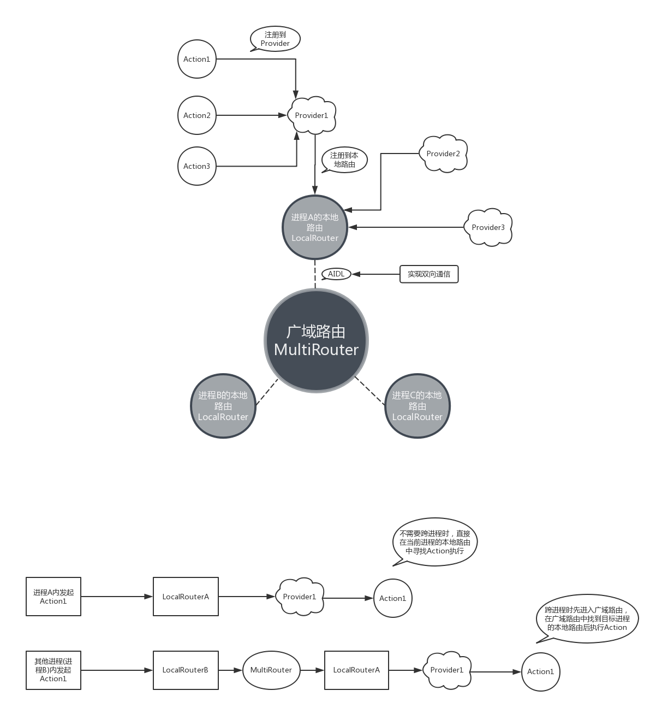

## 组件化的优点

1. 业务隔离，使得各业务模块专注于自己的业务实现，而不必关心其他业务模块.
2. 单独调试，每个模块可以独立运行，方便开发调试.
3. 组件可复用性，针对有重叠业务的不同APP，可直接使用组件来组装.
4. 适合AOP.

## 组件化开发的实现(Router)

### 1.组件跳转

    可添加跳转拦截器.

### 2.进程内组件间通信机制

    1. 服务提供者向Router注册Action对其他进程暴露服务.
    2. 多对多：LiveEventBus.

### 3.多进程通信机制

    1. 服务提供者向Router注册Action对其他进程暴露服务，传递的参数需要实现序列化，否则会被Router过滤掉.
    2. 多对多：LiveEventBus.

### 4.资源文件冲突
#### 1. AndroidManifest.xml合并：

  每个module都有一份自己的AndroidManifest清单文件，在APP的编译过程中最终会将所有module的清单文件合并成一份。

  我们可以在配置为Application的module下的build/intermediates/manifests路径下找到合成后的AndroidManifest文件,对比编译前后的差异就能大致分析出合并规则和冲突处理规则。

  需要注意的是如果在多个module中出现同名资源(如 android:label="@string/app_name")，且同名资源被合成后的AndroidManifest.xml引用，则会优先取用当前ApplicationModule的资源。

#### 2. R文件：

    libModule中R文件里的id不再是静态常量，而是静态变量，所以不能再使用switch..case..语法操作资源id

#### 3. 其他resource：

    1. 防止出现同名资源，建议每个module下的资源命名都增加唯一识别字符，如module-live中的都带前缀"mlive_"，mlive_icon_close.png

    2. 关于资源的拆分，一些style、常见的string、共用的图片、drawable等资源，建议存放在common_service当中。对于属于不同模块的资源则应该存放在各自的module中。

### 5.Module可独立运行配置

    第一步：在 工程根目录 下的gradle.properties下声明对应module是否独立运行的属性，如isDebugMode。因为gradle.properties中申明的属性在各个module的build.gradle中可以被直接访问
    第二步：在module的build.gradle文件中加上红框内的三个部分：
    设置module类型：
            if (isDebugMode.toBoolean()) {
                apply plugin: 'com.android.library'
            } else {
                apply plugin: 'com.android.application'
            }
    设置applicationId：
            if (!isDebugMode.toBoolean()) {
                applicationId "com.dovar.router"
            }
    使用sourceSets配置AndroidManifest等
           sourceSets {
                  main {
                      if (!rootProject.ext.isModule1Debug) {
                          manifest.srcFile 'src/debug/AndroidManifest.xml'
                          java.srcDir 'src/debug/java/'
                          res.srcDirs=['src/debug/res']
                      } else {
                          manifest.srcFile 'src/release/AndroidManifest.xml'
                          java.srcDir 'src/release/java/'
                      }
                  }
              }

     更好的实现方式应该是这样的：设置一个可运行的壳module，如demo中的app.然后在壳module中配置组件依赖.

### 6.组件化后的Git部署

    * git subtree/git submodule
    * 项目下的多仓库部署

## 建议

    1. 使用aar的形式引入依赖，有助于减少编译时间。
    2. 四大组件应该在各自module里面声明。

