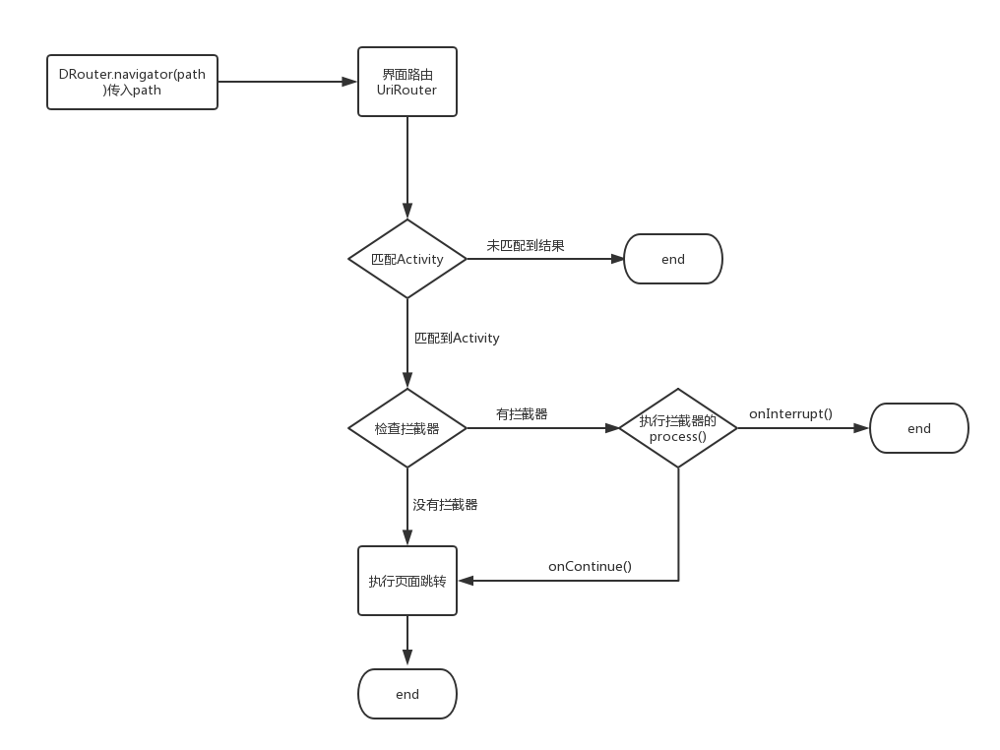
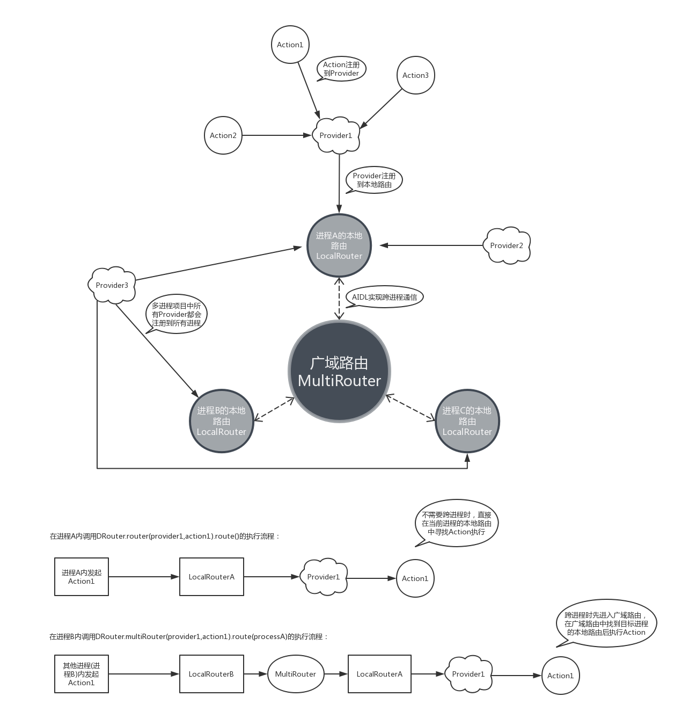
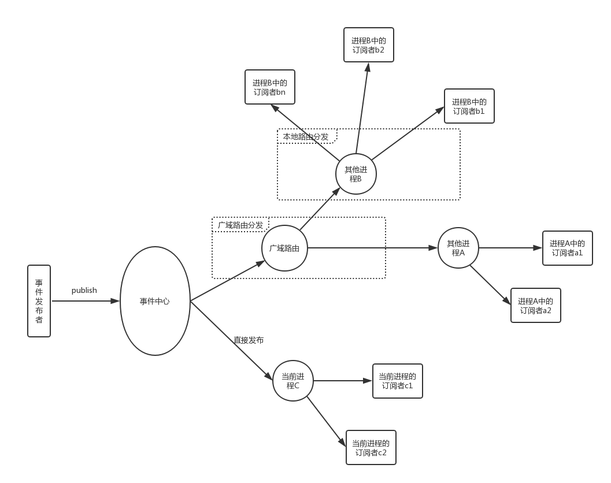
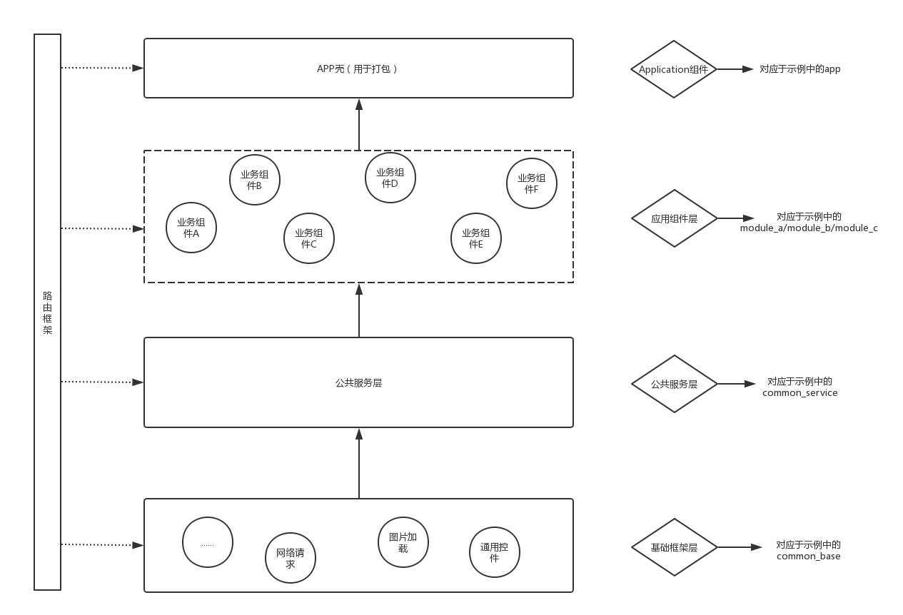

## 写在开头

组件化技术适用于需要多人协作的中大型项目，如果是一个人的项目且开发人员未实践过组件化方案则不建议采用。

## 组件化的优点

1. 业务隔离，使得各业务模块专注于自己的业务实现，而不必关心其他业务模块.
2. 单独调试，每个模块可以独立运行，方便开发调试.
3. 组件可复用性，针对有重叠业务的不同APP，可直接使用组件来组装.
4. 适合AOP.
5. 可以更细粒度的设置组员的代码修改权限.

## DRouter的组件化实现

### 界面路由

### 动作路由

### 事件总线

### 组件化项目架构图

关于APP壳工程

    管理打包配置.
    设置组件引用.
    集中管理混淆规则，各个组件中不再配置混淆文件.
    
关于应用组件层

    业务中心，包括业务组件和功能组件(功能组件专指没有UI逻辑的业务，注意区分，网络请求、图片加载这些属于基础框架层).
    
关于公共服务层
    
    管理跨组件调用和公共资源，详细可参考项目中的common_service.
    
    为什么要在基础框架层和应用组件层中间多架设一个公共服务层？
    
    * 封装对基础框架层功能API的调用，方便应对日后更换第三方库的需求，相信很多程序员都经历过更换第三方库(特别是基础库)的痛苦啦，
      如果项目中没有自己封装而是直接引用第三方API的话，等到要换的时候就会发现需要修改的代码实在太多了。
    * 储存公用资源和代码，暴露给上层业务使用，同时避免这些资源被下沉到基础框架层,从而减少对基础框架层的非必要更新。
      在多人协作项目中，基础框架必须是稳定的，所以我们希望有尽可能少的commit指向基础框架层。

关于基础框架层

    与业务无关的通用功能模块，如网络请求、图片加载、通用的自定义控件等.
    
### 1.组件跳转

    支持给Activity定义path，然后通过path跳转到Activity,可设置跳转拦截器.

### 2.进程内组件间通信机制

    1. 服务提供者向DRouter注册Action对其他组件暴露服务.
    2. 多对多：LiveEventBus.

### 3.多进程通信机制

    1. 服务提供者向DRouter注册Action对其他进程暴露服务，传递的参数需要实现序列化，否则会被DRouter过滤掉.
    2. 多对多：LiveEventBus.

### 4.资源文件冲突
#### 1. AndroidManifest.xml合并：

  每个module都有一份自己的AndroidManifest清单文件，在APP的编译过程中最终会将所有module的清单文件合并成一份。

  我们可以在配置为Application的module下的build/intermediates/manifests路径下找到合成后的AndroidManifest文件,对比编译前后的差异就能大致分析出合并规则和冲突处理规则。

  需要注意的是如果在多个module中出现同名资源(如 android:label="@string/app_name")，且同名资源被合成后的AndroidManifest.xml引用，则会优先取用当前ApplicationModule的资源。

#### 2. R文件：

    libModule中R文件里的id不再是静态常量，而是静态变量，所以不能再使用switch..case..语法操作资源id

#### 3. 其他resource：

    1. 防止出现同名资源，建议每个module下的资源命名都增加唯一识别字符，如module-live中的都带前缀"mlive_"，mlive_icon_close.png

        apply plugin: 'com.android.library'
        
        android {
            compileSdkVersion 27
        
            defaultConfig {
                minSdkVersion 15
                targetSdkVersion 27
                ...
            }
        
            resourcePrefix "module_a_" //可以利用 resourcePrefix 限定资源命名前缀
        }
    
    2. 关于资源的拆分，一些style、常见的string、共用的图片、drawable等资源，建议存放在common_service当中。对于属于不同模块的资源则应该存放在各自的module中。

### 5.如何配置Module单独调试？

    第一步：在 工程根目录 下的gradle.properties下声明对应module是否独立运行的属性，如isDebugMode。因为gradle.properties中申明的属性在各个module的build.gradle中可以被直接访问
    第二步：在module的build.gradle文件中加上红框内的三个部分：
    设置module类型：
            if (isDebugMode.toBoolean()) {
                apply plugin: 'com.android.library'
            } else {
                apply plugin: 'com.android.application'
            }
    设置applicationId：
            if (!isDebugMode.toBoolean()) {
                applicationId "com.dovar.router"
            }
    使用sourceSets配置AndroidManifest等
           sourceSets {
                  main {
                      if (isDebugMode.toBoolean()) {
                          manifest.srcFile 'src/debug/AndroidManifest.xml'
                      } else {
                          manifest.srcFile 'src/release/AndroidManifest.xml'
                      }
                  }
              }

     更好的实现方式应该是这样的：设置一个可运行的壳工程，如示例中的app.然后在壳工程中配置组件依赖.

### 6.组件化后的Git部署

    Note:你依然可以沿用现有项目的版本管理方案，可跳过此部分内容.
    
一般我们项目只会对应于一个Git仓库，于是所有开发成员都可以对项目中所有代码进行编辑并提交修改，但作为项目管理者，我们想让成员只能提交自己负责的业务代码，避免成员在开发过程中不小心修改了其他成员的代码导致出现bug。而通过组件化后，我们就可以根据成员开发职责重新设置代码修改权限啦。
     
假设：在开发过程中基础框架层不变，甲负责module_a，乙负责module_b，丙负责module_c和打包，甲乙丙都可以修改common_service。于是我们将module_a/module_b/module_c/common_service全都独立成子仓库，module_a仓库只对甲开放修改权限，module_b仓库只对乙开放修改权限，module_c仓库只对丙开放修改权限，于是就有下图所示的权限分布：

有以下三种Git部署方式可供选择：

    * 主项目下直接部署多个子仓库
        直接在主项目下引入所有子仓库.
        优点：不用学习新的Git命令.
        缺点：下载主项目时操作较复杂，需要先clone主项目然后再在主项目下clone子项目.(可以通过配置脚本完成一键clone).
        
    * git submodule
        关于submodule如何使用请自行百度.
        优点：使用比subtree简单，也没有第一种方式的Git clone问题.
        缺点：submodule的方式不能将在主项目中对子项目的修改推送到子项目仓库.
        
    * git subtree
        [如何使用](https://blog.csdn.net/Dovar_66/article/details/83185288)
        优点：可以将在主项目中对子项目的修改推送到子项目仓库.
        缺点：Git命令使用较复杂，组员学习成本高.
    
附一个AS插件，可能用得上：[一键Git Pull项目下所有仓库的当前分支](https://github.com/Dovar66/gitpullextender)

